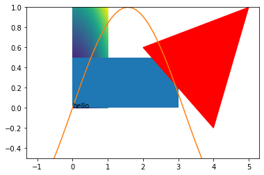
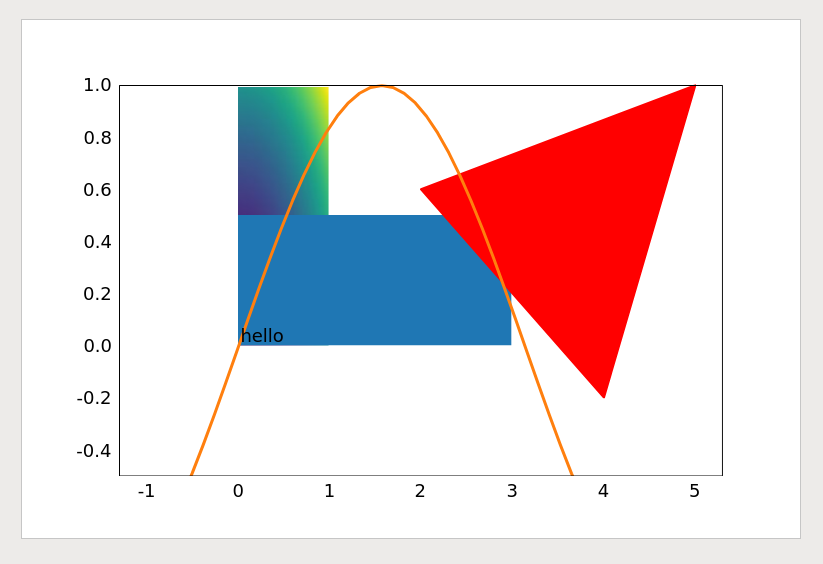

# MPLPPT
`mplppt` is a simple library made from some hacky scripts I used to use to convert matplotlib figures to powerpoint figures. Which makes this a hacky library, I guess 😀.

## Goal

`mplppt` seeks to implement an alternative `savefig` function for `matplotlib` figures. This `savefig` function saves a `matplotlib` figure with a single axis to a powerpoint presentation with a single slide containing the figure. 

## Installation
```bash
pip install mplppt
```

## Supported Conversions

`mplppt` supports [partly] conversion of the following matplotlib objects:
* Lines [`matplotlib.lines.Line2D`]
* Rectangles [`matplotlib.patches.Rectangle`]
* Polygons [`matplotlib.patches.Polygon`]
* pcolormesh [`matplotlib.collections.QuadMesh`]
* text [`matplotlib.text.Text`]

so far `mplppt` does not (yet) support (out of many other things):
* markers (including tick marks)
* linestyle


## Simple Example
An example of all different conversions available for mplppt. Below we give an example of how all these objects can be combined into a single plot, which can then be exported to powerpoint:


```python
# plot [Line2D]
x = np.linspace(-1,5)
y = np.sin(x)
plt.plot(x,y,color='C1')

# rectangle
plt.gca().add_patch(mpl.patches.Rectangle((0, 0), 3, 0.5))

# polygon
plt.gca().add_patch(mpl.patches.Polygon(np.array([[5.0,1.0],[4.0,-0.2],[2.0,0.6]]), color="red"))

# pcolormesh
x = np.linspace(0,1, 100)
y = np.linspace(0,1, 100)
X, Y = np.meshgrid(x,y)
Z = X**2 + Y**2
plt.pcolormesh(X,Y,Z)

# text
text = plt.text(0,0,'hello')

# set limits
plt.ylim(-0.5,1)

# Save figure to pptx
mplppt.savefig('first_example.pptx')

# show figure
plt.show()
```





Which results in a powerpoint slide which looks as follows:



## Cool! What else can I do with this?

You are not bound to using matplotlib! The `mplppt` repository contains some standard powerpoint shapes that you can use. Try something like:


```python
ppt = mplppt.Group() # Create a new group of objects
ppt += mplppt.Rectangle(name='rect', x=0, y=0, cx=100, cy=100, slidesize=(10,5)) # add an object to the group
ppt.save('second_example.pptx') # export the group as a ppt slide
```

## Is any of this documented?

No.

## How does this work?

The repository contains a template folder, which is nothing more than an empty powerpoint presentation which is unzipped. After making a copy of the template folder and adding some `xml` code for the shapes, the modified folder is zipped into a `.pptx` file.

## Copyright

© Floris Laporte - MIT License
